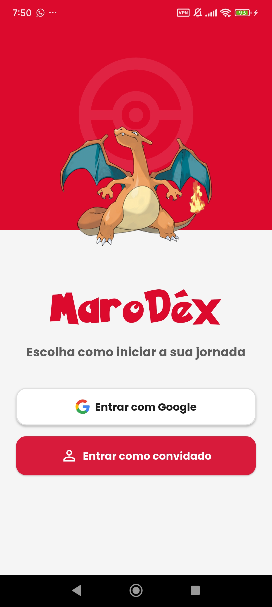
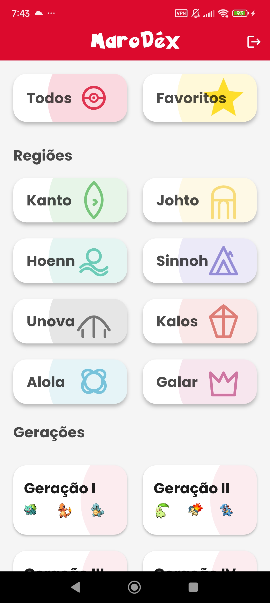
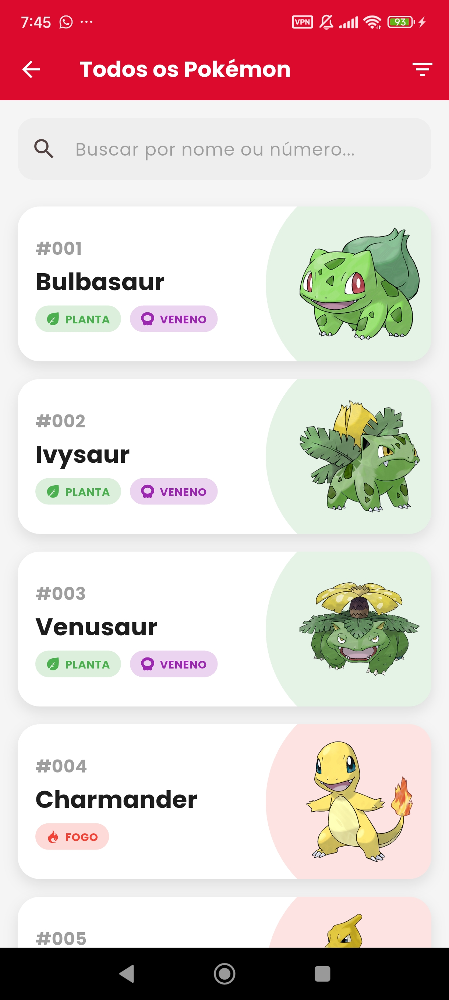
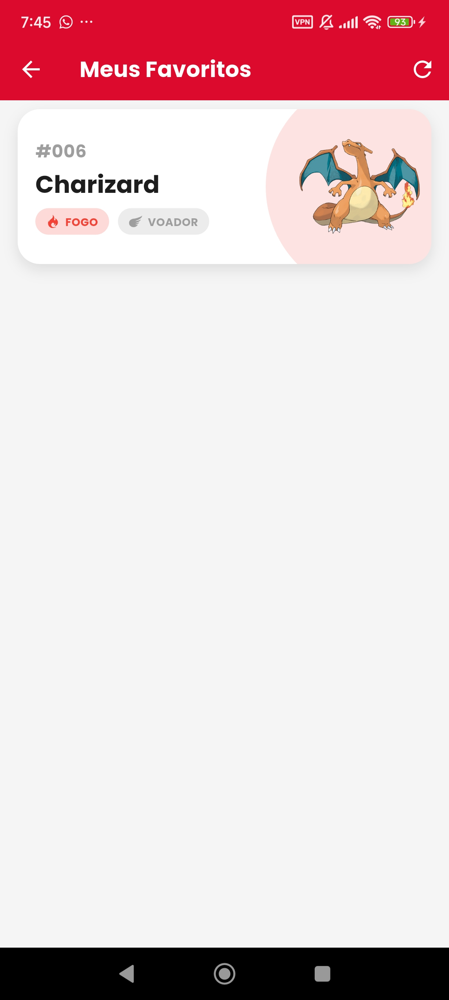
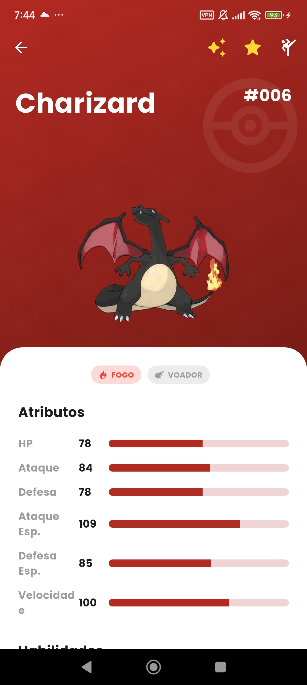
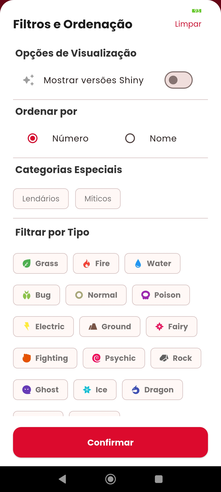
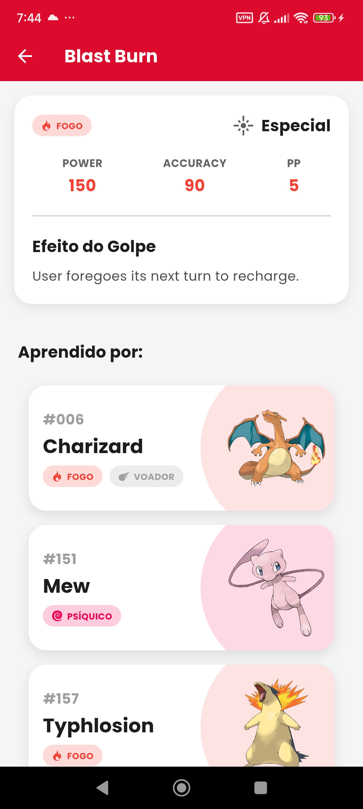
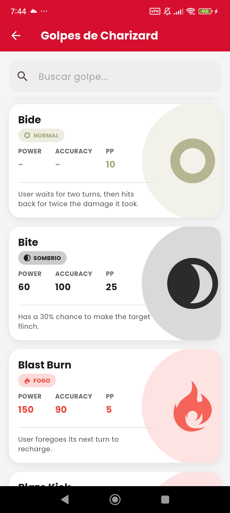

# MaroDéx  pokédex-app


Bem-vindo à MaroDéx, uma Pokédex moderna e completa construída com Flutter. Explore o vasto mundo Pokémon, descubra detalhes sobre suas criaturas favoritas, gerencie sua lista de favoritos e muito mais!

## ✨ Funcionalidades

O aplicativo oferece uma experiência rica e interativa para todos os treinadores Pokémon:

- **Autenticação de Utilizador**: Faça login com sua conta Google ou entre como convidado para uma experiência anônima.
- **Navegação por Gerações e Regiões**: Explore os Pokémon organizados por gerações (I a VIII) ou por regiões (Kanto, Johto, etc.).
- **Lista Completa de Pokémon**: Acesse a lista com todos os Pokémon disponíveis na API.
- **Pesquisa e Filtragem Avançada**:
  - Busque Pokémon por nome ou número.
  - Filtre a lista por tipo (Fogo, Água, Planta, etc.).
  - Ordene os resultados por número da Pokédex ou por ordem alfabética.
  - Filtre para ver apenas Pokémon Lendários ou Míticos.
- **Visualização de Detalhes**:
  - Veja informações completas como altura, peso, habilidades e estatísticas base (HP, Ataque, Defesa, etc.).
  - Visualize as evoluções de cada Pokémon e navegue entre elas.
  - Ouça o som característico (grito) de cada Pokémon.
  - Alterne entre a arte normal e a versão *Shiny*.
- **Sistema de Favoritos**:
  - Marque seus Pokémon preferidos com uma estrela.
  - Acesse uma tela dedicada apenas aos seus favoritos.
  - Os favoritos são salvos localmente para convidados e sincronizados com o Firestore para utilizadores logados.
- **Movesets Completos**:
  - Explore a lista de todos os golpes que um Pokémon pode aprender.
  - Veja detalhes de cada golpe, como poder, precisão, tipo e efeito.
  - Descubra quais outros Pokémon podem aprender um determinado golpe.

## 🚀 Tecnologias Utilizadas

Este projeto foi construído utilizando as seguintes tecnologias e pacotes:

- **Framework**: [Flutter](https://flutter.dev/)
- **Linguagem**: [Dart](https://dart.dev/)
- **Base de Dados (Backend)**: [Firebase](https://firebase.google.com/)
  - **Authentication**: Para login com Google e anônimo.
  - **Cloud Firestore**: Para salvar os Pokémon favoritos dos utilizadores logados.
- **API**: [PokéAPI](https://pokeapi.co/) - A principal fonte de dados sobre os Pokémon.
- **Gestão de Estado**: `ValueNotifier` para uma gestão de estado reativa e simples.
- **HTTP Requests**: Pacote `http` para comunicação com a PokéAPI.
- **Assets**: `flutter_svg` para a exibição de ícones de tipo em formato SVG.
- **Armazenamento Local**: `shared_preferences` e `path_provider` para cache de dados e favoritos de convidados.
- **Áudio**: `audioplayers` para tocar os sons dos Pokémon.

## 📸 Screenshots

### 🧑‍💼 Login


### 🏠 Tela Inicial


### 📋 Lista de Todos os Pokémon


### ⭐ Favoritos


### 🔍 Detalhes do Pokémon


### ✨ Versão Shiny


### ⚙️ Filtros


### 📊 Detalhes do Golpe


### 📘 Moveset Completo


---

## ⚙️ Como Executar o Projeto

Siga os passos abaixo para configurar e executar o projeto localmente.

### **Pré-requisitos**

- Ter o [Flutter SDK](https://flutter.dev/docs/get-started/install) instalado.
- Um editor de código como [VS Code](https://code.visualstudio.com/) ou [Android Studio](https://developer.android.com/studio).
- Um projeto Firebase configurado.

### **Passos de Instalação**

1. **Clone o repositório:**
    ```sh
    git clone https://github.com/AmaroMiranda/pokedex-app-flutter.git
    cd pokedex-app-flutter
    ```

2. **Configure o Firebase:**
    - Crie um novo projeto no [console do Firebase](https://console.firebase.google.com/).
    - Siga as instruções para adicionar o Firebase ao seu aplicativo Flutter usando o FlutterFire CLI. Isso irá gerar os arquivos `firebase_options.dart` e `google-services.json` específicos para o seu projeto.
    - **Importante**: Certifique-se de que os arquivos `google-services.json`, `firebase.json` e `lib/firebase_options.dart` estão no seu `.gitignore` para não expor suas chaves.

3. **Instale as dependências:**
    ```sh
    flutter pub get
    ```

4. **Execute o aplicativo:**
    ```sh
    flutter run
    ```

## 📂 Estrutura do Projeto

O projeto está organizado da seguinte forma para manter o código limpo e escalável:

lib/  
├── controllers/ # Lógica de negócio e gestão de estado das telas  
├── models/ # Modelos de dados (Pokemon, Move, etc.)  
├── repositories/ # Classes responsáveis pela comunicação com a API  
├── screens/ # Widgets que representam as telas do app  
├── services/ # Serviços de backend (Firebase Auth, Database)  
├── theme/ # Tema visual do aplicativo (cores, fontes)  
├── utils/ # Funções utilitárias e extensões  
├── widgets/ # Widgets reutilizáveis (cards, loading screens)  
└── main.dart # Ponto de entrada da aplicação


## 🤝 Contribuições

Contribuições são bem-vindas! Se você tiver ideias para novas funcionalidades ou melhorias, sinta-se à vontade para abrir uma *issue* ou enviar um *pull request*.

---

Feito por Amaro Miranda
